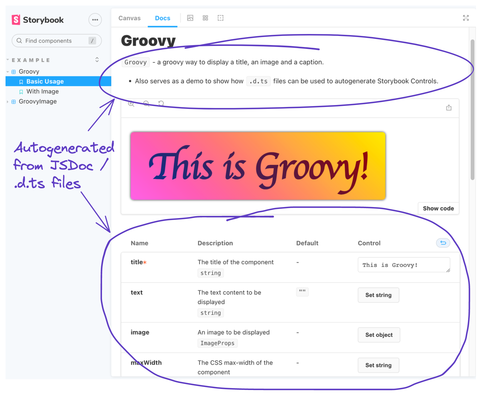

# Auto-generating Storybook Controls from JSDoc / .d.ts type definitions

This project demonstrates how to autogenerate [Storybook](https://storybook.js.org/) [Controls](https://storybook.js.org/docs/react/essentials/controls) from either [`JSDoc`](https://www.typescriptlang.org/docs/handbook/jsdoc-supported-types.html) comments or [TypeScript `.d.ts` files](https://www.typescriptlang.org/docs/handbook/declaration-files/introduction.html).

> **:warning: Important Note:** This is a demo project — these React components are not intended to be used by anyone or be examples of good practice in developing React components.

## TL;DR How do I get this auto-generation to work?

- Add a `typescript` property to your `.storybook/main.cjs` or `.storybook/main.js` file that tells Storybook to use `react-docgen-typescript` and to parse `.jsx` files with TypeScript (see the [TypeScript Storybook docs](https://storybook.js.org/docs/react/configure/typescript)):

  ```js
  typescript: {
    check: false,
    checkOptions: {},
    reactDocgen: "react-docgen-typescript",
    reactDocgenTypescriptOptions: {
      compilerOptions: {
        allowJs: true,
      },
      include: ["**/*.jsx"],
    },
  }
  ```

- If you want to use `JSDoc`, add TypeScript-compatible `JSDoc` comments to your components (see [`GroovyImage.jsx`](/src/components/GroovyImage.jsx) for an example).
- If you want to use `.d.ts` TypeScript definition files:
  - Create the definition files (see [`Groovy.d.ts`](/src/components/Groovy.d.ts))
  - Add a `JSDoc` `@type` comment to your component `.jsx` file (see [`Groovy.jsx`](/src/components/Groovy.jsx))

## What is this magic? How does it work?

TypeScript can parse and extract type information from JavaScript (and `.jsx`) files. The type information is extracted from `JSDoc` comments. By telling Storybook to treat JavaScript files as TypeScript, the metadata from the `JSDoc` comments can be used to generate the Controls.

Using the `JSDoc` `@type` directive you can import types from external files. This allows you to define your types in a `.d.ts` file and import them into the JavaScript file using `@type`. When TypeScript parses the JavaScript, it follows the link from the `JSDoc` to the `.d.ts` file and Storybook can use the metadata to extract controls.

## What does it look like?



- The Component description is populated from the `JSDoc` comment.
- The Controls table is populated based on the `JSDoc` / `.d.ts` files
- Updating a control in the Controls table will update the component in the canvas / story.

## Gotchas / limitations

- If you like to use `export default` for your React components, you'll have to add an additional named export. This allows `react-docgen-typescript` to work out the name of your component and match it to the correct stories.
- If you update a `.d.ts` definition file, the changes don't get hot reloaded (they do if you update a `JSDoc` comment). A workaround for this is to remove and re-add the `@type` `JSDoc` comment that references your `.d.ts` file.
- Default arguments are extracted from the JavaScript source code, not the `JSDoc` comments.
- Adding `JSDoc` comments or referencing `.d.ts` files gives no build time or runtime type checking of the parameters. You can, however, [type check your JavaScript files using TypeScript](https://www.typescriptlang.org/docs/handbook/type-checking-javascript-files.html).

## How can I run this example project?

```sh
npm install
npm run storybook
```
